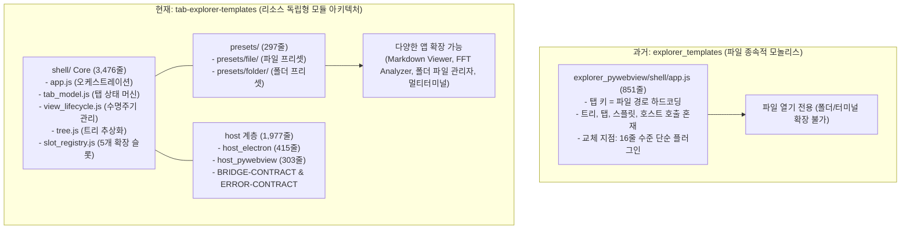

# explorer_templates vs tab-explorer-templates 심층 비교 분석 보고서

> **분석 대상**
> - 이전 프로젝트: [`_archive/260904_explorer_templates`](file:///D:/projects/_archive/260904_explorer_templates) (v0.1 동결본)
> - 현재 프로젝트: [`tab-explorer-templates`](file:///D:/projects/tab-explorer-templates) (v0.1 신규 재작성본)

---

## 1. 종합 개요 (Executive Summary)

[`_archive/260904_explorer_templates`](file:///D:/projects/_archive/260904_explorer_templates)가 **"파일 경로에 강하게 결합된 단일 목적의 파일 탐색기 껍데기 MVP"**였다면, 현재의 [`tab-explorer-templates`](file:///D:/projects/tab-explorer-templates)는 **"파일, 폴더, 터미널 세션 등 임의의 리소스를 수용할 수 있는 범용 탭 탐색기 플랫폼 템플릿"**으로 전면 재설계되었습니다.

이전 프로젝트에서 68건의 계획 외 개선을 통해 완성했던 시각 디자인 토큰과 아이콘 자산, 그리고 32건의 검증 항목은 100% 계승하되, 단일 851줄 모놀리식 구조였던 껍데기 코드를 완전히 폐기하고 **5대 교체 지점(5 Extension Slots)**과 **컴포넌트 수명주기(Lifecycle)** 기반으로 재작성했습니다.

---

## 2. 정량적 지표 비교 (코드양 및 파일 수)

디자인 에셋(SVG 1,554개 및 글꼴 파일 등 약 18,150줄)을 포함한 전체 규모와, 실제 순수 로직/테스트 코드의 정량 비교는 다음과 같습니다.

### 2.1 전체 및 확장자별 코드 규모

| 구분 | `explorer_templates` (이전) | `tab-explorer-templates` (현재) | 증감량 | 변동률 |
| :--- | :---: | :---: | :---: | :---: |
| **총 파일 수** (자산 포함) | 1,607개 | 1,625개 | +18개 | +1.1% |
| **총 라인 수** (자산 포함) | 30,729줄 | 32,346줄 | +1,617줄 | +5.3% |
| **JavaScript (`.js`)** | 1,001줄 (5개) | **7,618줄 (30개)** | **+6,617줄** | **+661.0% (7.6배)** |
| **Python (`.py`)** | 985줄 (7개) | **1,304줄 (11개)** | **+319줄** | **+32.4%** |
| **CSS (`.css`)** | 246줄 (2개) | **894줄 (2개)** | **+648줄** | **+263.4% (3.6배)** |
| **문서 (`.md`)** | 9,031줄 (20개) | 2,760줄 (13개) | -6,271줄 | -69.4% (히스토리 정리) |

> [!NOTE]
> - JavaScript 라인 수가 1,001줄에서 **7,618줄로 약 7.6배 급증**한 주된 원인은 **테스트 코드의 고도화 (4,821줄)** 및 **셸 모듈화·수명주기 엔진 도입 (3,476줄)** 때문입니다.
> - 이전 프로젝트의 방대했던 v0.1 작업 기록 문서는 정리되고, 현 프로젝트는 6종 핵심 문서(`docs/current/`) 체계로 압축 정립되었습니다.

### 2.2 디렉터리 역할별 코드량 비교

| 영역 (디렉터리) | `explorer_templates` (이전) | `tab-explorer-templates` (현재) | 핵심 변경 내용 |
| :--- | :---: | :---: | :--- |
| **껍데기 코어 (`shell/`)** | 851줄 (단일 파일) | **3,476줄** (7개 파일) | 모놀리스 `app.js` 해체 → `tab_model`, `view_lifecycle`, `tree`, `slot_registry` 모듈화 |
| **확장 프리셋 (`presets/`)** | 9줄 (`plugin_stub`) | **297줄** (5개 파일) | 파일 프리셋 및 폴더 프리셋 정식 지원 (`preset.js` + `reference_view.js`) |
| **Electron 호스트 (`host_electron/`)** | 125줄 (코드 2개) | **433줄** (코드 2개, lock 제외) | 창 상태 관리, 정밀한 브릿지 계약 및 샌드박스 보안 경로 검증 완비 |
| **pywebview 호스트 (`host_pywebview/`)** | 499줄 (코드 4개) | **539줄** (코드 4개) | 정적 파일 서빙 보안 강화, 11개 브릿지 계약 및 심볼릭 링크 탈출 방지 |
| **테스트 코드 (`tests/`)** | **380줄** (2개 파일) | **4,821줄 (24개 파일)** | **12.7배 증가**. 단위/통합/대칭성/접근성/회귀(32건) 자동화 검증 완비 |
| **공유 디자인 자산 (`shared/design/`)** | 18,148줄 (1,560개) | 18,172줄 (1,560개) | 토큰 59종 및 SVG 에셋 보존 + 런타임 [`icon_theme.js`](file:///D:/projects/tab-explorer-templates/shared/design/icon_theme.js) 엔진 신설 |

---

## 3. 핵심 아키텍처 및 기능 개선 사항

### 3.1 탭 식별자와 대상 주소의 분리 (Decoupling)

- **과거 (`explorer_templates`)**:
  - 탭 열기, 닫기, 스플릿 이동 등의 키가 `filePath` 문자열로 하드코딩되어 있었습니다.
  - 하나의 파일은 오직 하나의 탭만 가질 수 있었고, 파일이 아닌 폴더나 세션 기반 탭(동일 폴더 내 복수 터미널 세션 등)을 여는 것이 구조적으로 불가능했습니다.
- **현재 (`tab-explorer-templates`)**:
  - 탭의 고유 식별자(`tabId`)와 대상 리소스 주소(`uri` / `target`), 그리고 리소스 종류(`kind`)를 분리했습니다 ([`shell/tab_model.js`](file:///D:/projects/tab-explorer-templates/shell/tab_model.js)).
  - 동일한 리소스 주소(예: 동일 작업 폴더)에 대해서도 복수의 독립적인 탭 세션을 생성할 수 있습니다.

### 3.2 5대 교체 지점 (Extension Slots)과 프리셋 체계

- **과거 (`explorer_templates`)**:
  - 교체 가능한 영역은 [`explorer_pywebview/shell/plugin_registry.js`](file:///D:/projects/_archive/260904_explorer_templates/explorer_pywebview/shell/plugin_registry.js) 16줄 수준으로, 단순히 파일 렌더러 함수 하나만 꽂을 수 있었습니다.
- **현재 (`tab-explorer-templates`)**:
  - 껍데기(`shell`)는 리소스의 성격을 일체 알지 못하며([`CLAUDE.md:L23`](file:///D:/projects/tab-explorer-templates/CLAUDE.md#L23)), 다음 5개 슬롯을 통해 앱의 동작을 정의합니다 ([`shell/slot_registry.js`](file:///D:/projects/tab-explorer-templates/shell/slot_registry.js), [`DECISIONS.md:D-3`](file:///D:/projects/tab-explorer-templates/docs/current/DECISIONS.md#L65-L96)):
    1. **트리 항목 필터/선택자**: 트리에 표시할 항목 결정 (파일+폴더 vs 폴더 전용 등)
    2. **행 선택 매핑**: 특정 행 클릭 시 열릴 리소스 탭 종류 결정
    3. **보기 제공자 (View Provider)**: 탭 콘텐츠를 렌더링하고 수명주기를 관리
    4. **중복 정책 (Duplicate Policy)**: 동일 리소스 재오픈 시 기존 탭 재활용 범위 (조각 내부 vs 전체 패널)
    5. **여는 경로 (Open Path)**: 트리 더블클릭 외의 오픈 수단 (`+` 버튼, 명령 등)
  - 이 슬롯들을 묶어 기본 제공하는 **[`presets/file`](file:///D:/projects/tab-explorer-templates/presets/file/preset.js)**과 **[`presets/folder`](file:///D:/projects/tab-explorer-templates/presets/folder/preset.js)**을 내장하여 템플릿 복제 즉시 원하는 계열을 선택해 개발할 수 있습니다.

### 3.3 뷰 컴포넌트 수명주기(Lifecycle) 및 상태 분리

- **과거 (`explorer_templates`)**:
  - 탭을 전환하거나 패널을 가를 때마다 단순히 DOM을 지우고 다시 그리는 무상태 방식이었습니다.
  - 장기 실행 프로세스(터미널)나 메모리 상에 대량 데이터를 유지해야 하는 분석 도구(FFT NumPy 배열, ROI 편집 상태)를 올리면 상태가 즉시 유실되었습니다.
- **현재 (`tab-explorer-templates`)**:
  - 정교한 컴포넌트 수명주기 엔진([`shell/view_lifecycle.js`](file:///D:/projects/tab-explorer-templates/shell/view_lifecycle.js))을 도입했습니다:
    - `mount(container, resource)`: 탭 생성 시 인스턴스 초기화
    - `activate()` / `deactivate()`: 탭 전환 시 활성화/비활성화 (백그라운드 리소스 절약)
    - `resize(width, height)`: 패널 크기 조절 시 컴포넌트 반응
    - `destroy()`: 탭이 완전히 닫힐 때만 최종 정리
  - **상태의 2원화 ([`DECISIONS.md:D-5`](file:///D:/projects/tab-explorer-templates/docs/current/DECISIONS.md#L123-L150))**:
    - 세션 임시 상태(스크롤 위치, 줌 등): 껍데기가 세션 내에서 보관·전달
    - 영속 도메인 상태(사용자 정의 설정, ROI 좌표 등): 뷰 컴포넌트가 자체 파일에 직접 영속화하여 껍데기의 책임 분리

### 3.4 호스트 계층 계약 및 보안 강화

- **과거 (`explorer_templates`)**:
  - `pywebview`와 `electron`의 구현 편차가 컸으며, 에러 발생 시 처리 규약이 모호했습니다.
  - 상위 디렉터리 순회(`..`)나 외부 절대 경로 접근에 대한 방어가 불완전했습니다.
- **현재 (`tab-explorer-templates`)**:
  - **[`docs/BRIDGE-CONTRACT.md`](file:///D:/projects/tab-explorer-templates/docs/BRIDGE-CONTRACT.md)**: 11개 호스트 브릿지 API 동작 규격화.
  - **[`docs/ERROR-CONTRACT.md`](file:///D:/projects/tab-explorer-templates/docs/ERROR-CONTRACT.md)**: 6대 공통 에러 코드 규격화 (`ROOT_ESCAPE`, `NOT_FOUND`, `PERMISSION_DENIED`, `READ_FAILED`, `USER_CANCELLED`, `UNSUPPORTED_TARGET`).
  - **보안 샌드박스 완비**: `..` 상위 경로 탈출, 드라이브 절대경로 침범, 루트 외부를 가리키는 심볼릭 링크를 호스트 레벨([`host_pywebview/host/bridge.py`](file:///D:/projects/tab-explorer-templates/host_pywebview/host/bridge.py), [`host_electron/host/main.js`](file:///D:/projects/tab-explorer-templates/host_electron/host/main.js))에서 완벽 차단.
  - **무빌드(No-build) 무의존성 경로**: 두 호스트 모두 번들러 없이 최상위 [`shell/index.html`](file:///D:/projects/tab-explorer-templates/shell/index.html)을 100% 동일하게 직접 로드.

### 3.5 UI 완성도 및 실제 동작하는 아이콘 테마 엔진

- **과거 (`explorer_templates`)**:
  - 테마 아이콘 자산(Seti, VS Code Icons 등 8.3MB)을 폴더에 넣어두었으나 실제 런타임에서 이를 동적으로 읽어 트리에 반영하는 코드가 없어 단순 단색 아이콘만 표시되었습니다.
- **현재 (`tab-explorer-templates`)**:
  - **[`shared/design/icon_theme.js`](file:///D:/projects/tab-explorer-templates/shared/design/icon_theme.js)**를 신설하여 Simple(기본), VS Code Built-in(Seti/Codicon 글리프 폰트), VS Code Icons(SVG 에셋) 3개 테마가 런타임에 완벽하게 렌더링되도록 구현했습니다 ([`PROGRESS.md:L745-L760`](file:///D:/projects/tab-explorer-templates/docs/current/PROGRESS.md#L745-L760)).
  - 메뉴 팝업 경계 이중선 제거, 1px 고해상도 사각 포커스 인디케이터, 탭 높이 일치화(22px), `Tab`/`Shift+Tab` 양방향 탐색기-스플릿 순환 포커스, 반대편 중복 탭 이동 방지 등 미세 UX 개선 반영.

---

## 4. 테스트 및 품질 보증 체계 비교

| 비교 항목 | `explorer_templates` (이전) | `tab-explorer-templates` (현재) |
| :--- | :--- | :--- |
| **테스트 스위트 규모** | 2개 파일, **380줄** | **24개 파일, 4,821줄 (12.7배)** |
| **v0.1 회귀 검증** | - | **13개 묶음 32건 전건 통과** ([`tests/test_v01_coverage.js`](file:///D:/projects/tab-explorer-templates/tests/test_v01_coverage.js)) |
| **모듈별 단위 검증** | 전무 | 탭 모델, 트리 모델, 슬롯 레지스트리, 뷰 수명주기, 아이콘 엔진 개별 단위 테스트 완비 |
| **호스트 대칭성 검증** | 단순 parity 테스트 (41줄) | 브릿지 계약 11종 및 에러 코드 6종 대칭 검증 ([`test_bridge_electron.js`](file:///D:/projects/tab-explorer-templates/tests/test_bridge_electron.js), [`test_bridge_pywebview.py`](file:///D:/projects/tab-explorer-templates/tests/test_bridge_pywebview.py)) |
| **시각/접근성 검증** | 수동 검사 의존 | 대비율 계산(NFR-3), 짝수 픽셀 정렬, 포커스 상태 자동화 테스트 완비 |

---

## 5. 상세 파일 대응 관계표

| 이전 위치 (`explorer_templates`) | 현재 위치 (`tab-explorer-templates`) | 변경 및 발전 내용 |
| :--- | :--- | :--- |
| `explorer_pywebview/shell/app.js` (851줄) `explorer_electron/shell/index.html` (17줄) | [`shell/app.js`](file:///D:/projects/tab-explorer-templates/shell/app.js) (1,323줄) [`shell/tab_model.js`](file:///D:/projects/tab-explorer-templates/shell/tab_model.js) (471줄) [`shell/tree.js`](file:///D:/projects/tab-explorer-templates/shell/tree.js) (399줄) [`shell/view_lifecycle.js`](file:///D:/projects/tab-explorer-templates/shell/view_lifecycle.js) (299줄) [`shell/slot_registry.js`](file:///D:/projects/tab-explorer-templates/shell/slot_registry.js) (161줄) [`shell/index.html`](file:///D:/projects/tab-explorer-templates/shell/index.html) (20줄) | 모놀리스 코드 분해, 관심사 분리(SoC), 껍데기 공유화(중복 제거), 컴포넌트 수명주기 및 5대 교체 슬롯 완성 |
| `explorer_pywebview/plugin_stub/reference_plugin.js` (9줄) | [`presets/file/`](file:///D:/projects/tab-explorer-templates/presets/file/) (135줄) [`presets/folder/`](file:///D:/projects/tab-explorer-templates/presets/folder/) (130줄) [`presets/active.js`](file:///D:/projects/tab-explorer-templates/presets/active.js) (32줄) | 단순 문자열 출력 플러그인에서 파일/폴더 대상의 실질적인 프리셋 및 수명주기 뷰 참조 구현체로 격상 |
| `explorer_electron/host/main.js` (106줄) | [`host_electron/host/main.js`](file:///D:/projects/tab-explorer-templates/host_electron/host/main.js) (415줄) | 11개 브릿지 계약 준수, 경로 탈출 보안 검증, 세팅 복구 및 창 상태 이벤트 연동 |
| `explorer_pywebview/host/bridge.py` (270줄) | [`host_pywebview/host/bridge.py`](file:///D:/projects/tab-explorer-templates/host_pywebview/host/bridge.py) (303줄) | 브릿지 계약 표준화, 심볼릭 링크 보안 차단, 무오류 fallback 세팅 핸들러 |
| (미구현 상태 자산만 존재) | [`shared/design/icon_theme.js`](file:///D:/projects/tab-explorer-templates/shared/design/icon_theme.js) (179줄) | Simple, VS Code Built-in(Seti), VS Code Icons(SVG) 3종 테마 런타임 해석 엔진 신설 |
| `tests/` (2개 파일, 380줄) | [`tests/`](file:///D:/projects/tab-explorer-templates/tests/) (24개 파일, 4,821줄) | 전체 아키텍처 단위/통합/대칭/회귀 테스트 체계 구축 |

---

## 6. 결론

[`tab-explorer-templates`](file:///D:/projects/tab-explorer-templates)는 [`_archive/260904_explorer_templates`](file:///D:/projects/_archive/260904_explorer_templates)의 **시각적 자산과 검증 기준을 온전히 보존하면서도, 코드 구조를 완전히 현대화하여 확장 한계를 근본적으로 해결**했습니다.

1. **확장성**: 탭의 대상이 파일 경로에 묶여 있던 제약을 풀어, 향후 계획된 마크다운 뷰어, FFT 신호 분석기뿐만 아니라 듀얼 패널 파일 관리자, 멀티터미널 등의 도구를 동일한 템플릿 위에서 교체 지점만 정의하여 즉시 제작할 수 있게 되었습니다.
2. **신뢰성**: 테스트 코드가 380줄에서 4,821줄로 12배 이상 강화되었고, 호스트-셸 간 브릿지 및 보안 계약이 규격화되어 어떤 환경(Electron / pywebview)에서도 일관된 동작을 보장합니다.
3. **유지보수성**: 껍데기 코드(`shell/`)를 두 호스트가 100% 무빌드로 공유하므로, UI 개선이나 버그 수정 시 단 한 곳만 수정하면 양대 플랫폼에 즉시 반영됩니다.
